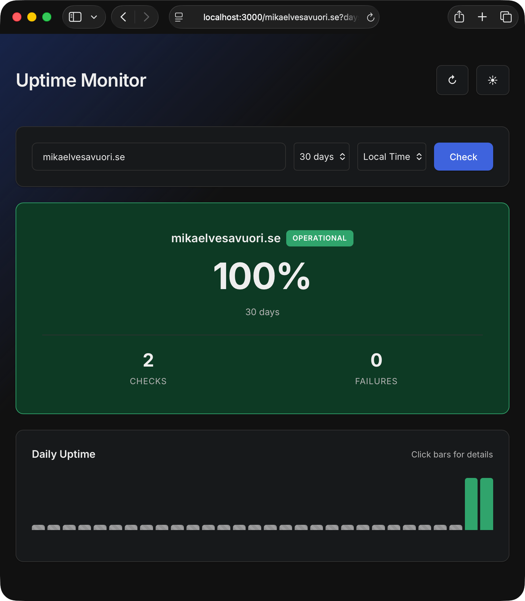

# MikroAPM

Ultralight uptime monitoring. Checks your sites, stores failures, optionally sends email alerts via [Brevo](https://www.brevo.com/), and serves a dashboard.



Two adapters included: **Cloudflare Workers + KV** and **Hono server + PikoDB**.

## Quick start

### Server (Hono + PikoDB)

Create a `mikroapm.config.json`:

```json
{
  "sites": [
    { "url": "https://example.com", "timeout": 10000 }
  ]
}
```

Start the server:

```bash
npm install
npm run dev:server
```

Open `http://localhost:3000` for the dashboard.

**Built-in scheduler**: Health checks run automatically on startup and every minute by default. Configure the interval with `CHECK_INTERVAL_MINUTES`:

```bash
CHECK_INTERVAL_MINUTES=5 npm run dev:server  # Check every 5 minutes
```

To disable the built-in scheduler and trigger checks manually:

```bash
ENABLE_SCHEDULER=false npm run dev:server

# Then trigger manually
curl -X POST http://localhost:3000/api/check
```

### Cloudflare Workers

Copy the example config and set your KV namespace ID:

```bash
cp wrangler.example.toml wrangler.toml
# Edit wrangler.toml and set your KV namespace ID
```

Deploy and configure sites via the API:

```bash
npx wrangler deploy -c wrangler.toml

curl -X POST https://your-worker.workers.dev/api/sites \
  -H "Content-Type: application/json" \
  -d '[{ "url": "https://example.com", "timeout": 10000 }]'
```

Health checks run on a cron schedule (default: every minute). Configure the schedule in `wrangler.toml`:

```toml
[triggers]
crons = ["*/5 * * * *"]          # Every 5 minutes

[vars]
CHECK_INTERVAL_MINUTES = "5"     # Must match cron frequency!
ENABLE_SUMMARY_WRITES = "false"  # Optional: disable for max efficiency
```

**Important**: `CHECK_INTERVAL_MINUTES` must match your cron frequency for accurate uptime calculations.

**Cost optimization**: Set `ENABLE_SUMMARY_WRITES = "false"` to stay within KV free tier with 1-minute intervals (near-zero writes for healthy sites).

## Configuration

MikroAPM uses a **unified configuration system** with precedence: **environment variables > config file > defaults**. This works consistently across both adapters.

### Config file (optional, recommended for server)

Create `mikroapm.config.json` to define sites and default settings. The config is validated using [MikroValid](https://github.com/mikaelvesavuori/mikrovalid).

```json
{
  "sites": [
    { "url": "https://example.com", "timeout": 10000, "alertEmail": "you@example.com" },
    { "url": "https://api.example.com/health", "timeout": 5000 }
  ],
  "checkIntervalMinutes": 1,
  "enableSummaryWrites": true,
  "alerts": {
    "threshold": 3,
    "fromEmail": "alerts@yourdomain.com",
    "fromName": "MikroAPM",
    "toEmail": "fallback@example.com"
  }
}
```

**Config options:**

- `sites` — required, at least one entry. Each site needs a `url`; `timeout` (ms) and `alertEmail` are optional.
- `checkIntervalMinutes` — optional, defaults to `1`. How often health checks run (in minutes).
  - For the Hono server, this controls the built-in scheduler.
  - For Cloudflare Workers, this must match your cron schedule in `wrangler.toml`.
- `enableSummaryWrites` — optional, defaults to `true`.
  - Set to `false` to disable daily summary writes for maximum cost efficiency. Dashboard will show minimal data (only failures), but write operations are drastically reduced.
- `alerts` — entirely optional. Omit this section to disable alerting.
  - If present, the Brevo API key must be set as an environment variable: `BREVO_API_KEY=your-key`.

### Environment Variables

All configuration options can be set via environment variables. **Environment variables always override config file values.**

#### Core Settings

| Variable                 | Description                                  | Default | Applies To |
|--------------------------|----------------------------------------------|---------|------------|
| `CHECK_INTERVAL_MINUTES` | Health check interval in minutes             | `1`     | Both       |
| `ENABLE_SUMMARY_WRITES`  | Enable daily summary writes (`true`/`false`) | `true`  | Both       |
| `BREVO_API_KEY`          | Brevo API key for email alerts               | —       | Both       |

#### Alert Settings

| Variable           | Description                                              | Default                 | Applies To |
|--------------------|----------------------------------------------------------|-------------------------|------------|
| `ALERT_THRESHOLD`  | Consecutive failures before alerting                     | `3`                     | Both       |
| `ALERT_FROM_EMAIL` | Sender email address                                     | `alerts@yourdomain.com` | Both       |
| `ALERT_FROM_NAME`  | Sender name                                              | `MikroAPM`              | Both       |
| `ALERT_TO_EMAIL`   | Default recipient (fallback if site has no `alertEmail`) | —                       | Both       |

#### Server-Specific Settings

| Variable           | Description                       | Default                  |
|--------------------|-----------------------------------|--------------------------|
| `ENABLE_SCHEDULER` | Enable built-in scheduler         | `true`                   |
| `PORT`             | Server port                       | `3000`                   |
| `CONFIG_PATH`      | Path to config file               | `./mikroapm.config.json` |
| `DB_PATH`          | Path to PikoDB database directory | `./data/mikroapm`        |

**Configuration examples:**

Server with config file:

```bash
BREVO_API_KEY=your-key npm start
```

Server with environment variables only:

```bash
ALERT_THRESHOLD=5 \
ALERT_FROM_EMAIL=alerts@example.com \
ALERT_TO_EMAIL=admin@example.com \
BREVO_API_KEY=your-key \
npm start
```

Cloudflare Workers (in `wrangler.toml`):

```toml
[vars]
CHECK_INTERVAL_MINUTES = "5"
ALERT_THRESHOLD = "3"
ALERT_FROM_EMAIL = "alerts@yourdomain.com"
ALERT_FROM_NAME = "MikroAPM"
ALERT_TO_EMAIL = "admin@yourdomain.com"

# Set secret via: npx wrangler secret put BREVO_API_KEY
```

## How check counting works

MikroAPM calculates total checks based on **elapsed time** rather than storing individual check results. Each check cycle updates a daily summary (not individual check records), minimizing storage usage for cost-sensitive environments like Cloudflare Workers with KV.

_The summary writes can be trimmed to near-zero; see below for details._

### Calculation method

Check counts are calculated as:

```javascript
checksToday = floor((now - effectiveStart) / checkInterval)
```

Where `effectiveStart` is the most recent of:

- Start of the current day (00:00 UTC)
- When monitoring first began for this domain
- When the service/worker last started (for mid-day restarts)

### What gets written per check cycle

**When `ENABLE_SUMMARY_WRITES=true` (default):**

Each check cycle (e.g., every minute) writes:

- 1 update: Daily summary for each monitored site (`summary:domain:date`) — updates failure count and last-checked timestamp
- 1 write per failure: Failure record only when a check fails (`failure:domain:date:time:timestamp`)
- 1 write on first check: Monitoring start timestamp per domain (one-time, persisted)

**When `ENABLE_SUMMARY_WRITES=false`:**

Each check cycle writes:

- 0 writes for successful checks
- 1 write per failure only
- 1 write on first check: Monitoring start timestamp per domain (one-time, persisted)

**Key insight**: Individual successful check results are NOT stored as separate records. The total check count is derived from time elapsed, not by counting stored records.

### Cost implications for Cloudflare Workers

With Cloudflare KV:

- **Free tier**: 1,000 writes/day, 100,000 reads/day
- **1 site @ 1-min interval**: ~1,440 writes/day (**exceeds free tier by 44%**)
- **1 site @ 3-min interval**: ~480 writes/day (**well within free tier**)
- **1 site @ 5-min interval**: ~288 writes/day (**well within free tier**)
- **With failures**: Additional 1 write per failed check

**Recommendation**: Use `CHECK_INTERVAL_MINUTES` of 3 or 5 to stay comfortably within free tier limits. A 5-minute interval still provides useful uptime tracking while allowing you to monitor 3+ sites without exceeding the free tier.

**Maximum efficiency**: Set `ENABLE_SUMMARY_WRITES=false` to disable daily summary writes entirely. This reduces writes to near-zero for healthy sites (only failures + one-time monitoring start). Trade-off: Dashboard will show "N/A" for uptime/check counts; only failure history will be visible. Best for alert-focused monitoring where dashboard visibility is not important.

## API

| Method | Path                          | Description                                           |
|--------|-------------------------------|-------------------------------------------------------|
| `GET`  | `/`                           | Dashboard UI                                          |
| `GET`  | `/mydomain.com`               | Dashboard UI: For site `mydomain.com`                 |
| `GET`  | `/mydomain.com?days=7`        | Dashboard UI: For site `mydomain.com` (7 day period)  |
| `GET`  | `/mydomain.com?days=30`       | Dashboard UI: For site `mydomain.com` (30 day period) |
| `GET`  | `/mydomain.com?days=90`       | Dashboard UI: For site `mydomain.com` (90 day period) |
| `GET`  | `/api/uptime/:domain?days=30` | Uptime stats for a domain                             |
| `GET`  | `/api/failures/:domain/:date` | Failure details for a specific day                    |
| `GET`  | `/api/sites`                  | List monitored sites                                  |
| `POST` | `/api/sites`                  | Update monitored sites                                |
| `POST` | `/api/check`                  | Trigger health check (server only)                    |
| `POST` | `/api/cleanup`                | Clean up expired records (server only)                |

## Building

```bash
npm run build              # Both targets
npm run build:server       # Hono server → dist/server.js
npm run build:workers      # CF Workers → dist/workers.js
```

## Project structure

```text
mikroapm.config.json       # Site + alert configuration (server)
src/
  core/
    ConfigManager.js       # Loads + validates config (file or env)
    HealthCheckService.js  # Runs checks, stores failures, triggers alerts
    AlertService.js        # Email alerts via Brevo (optional)
    DashboardService.js    # Queries uptime data for the dashboard
  storage/
    StorageInterface.js    # Interface (get/put/delete/list)
    KVStorage.js           # Cloudflare KV
    PikoDBStorage.js       # PikoDB (file-based)
  adapters/
    cf-workers/            # Cloudflare Workers (scheduled + fetch)
    hono-server/           # Hono on Node.js
    dashboard-template.js  # Shared dashboard HTML
examples/
  cf-workers/worker.js     # Workers entry point
  server/dev.js            # Dev server
  server/start.js          # Production server
```

## Dependencies

The project uses these bundled dependencies:

- [hono](https://hono.dev)
- [mikrovalid](https://github.com/mikaelvesavuori/mikrovalid)
- [pikodb](https://github.com/mikaelvesavuori/pikodb)

The rendered UI has a link to the [Inter font family](https://rsms.me/inter/) to make the site look pretty. You can remove it from the dashboard template if you want complete runtime isolation. Just remove:

```html
<link rel="preconnect" href="https://rsms.me/">
<link rel="stylesheet" href="https://rsms.me/inter/inter.css">
```


## License

MIT
