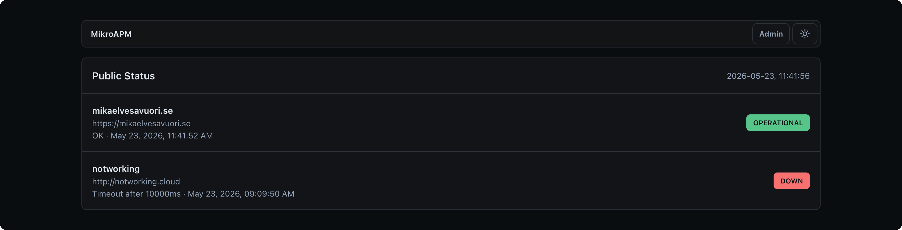

MikroAPM is a small uptime monitoring service for people who want to own their operational signals. It checks configured URLs, stores current status and failures, sends webhook or email alerts, and exposes a public dashboard for status review.

It is intentionally narrower than a full APM suite. It does not try to replace traces, profiles, logs, or metrics pipelines. Its job is to answer a practical question quickly: are the important services reachable, and what happened when they were not?

:::tip[Related: MikroScope]
MikroAPM handles uptime checks, alerts, and status pages. Use [MikroScope](/scope/docs/getting-started/intro) when you also want to inspect structured logs around an incident.
:::

## Why Choose It

- **Small enough to inspect**. The core is health checks, storage, alerts, and a dashboard.
- **Two runtimes**. Run it as a Hono Node server with PikoDB storage, or as a Cloudflare Worker with KV.
- **Plain configuration**. Sites can live in JSON, environment variables override operational settings, and admin writes require an admin password.
- **Useful checks**. Configure method, headers, body, expected status codes, expected text, latency limits, retries, timeouts, pauses, and maintenance windows.
- **Alertable failures**. Send webhook events and optional Brevo email notifications after a threshold of consecutive failures.
- **Public status dashboard**. Share uptime and incident views without exposing site configuration.

## Good Fits

MikroAPM works well for personal infrastructure, small SaaS products, public websites, docs sites, internal APIs, and other services where a clear health signal matters more than a sprawling telemetry stack.
